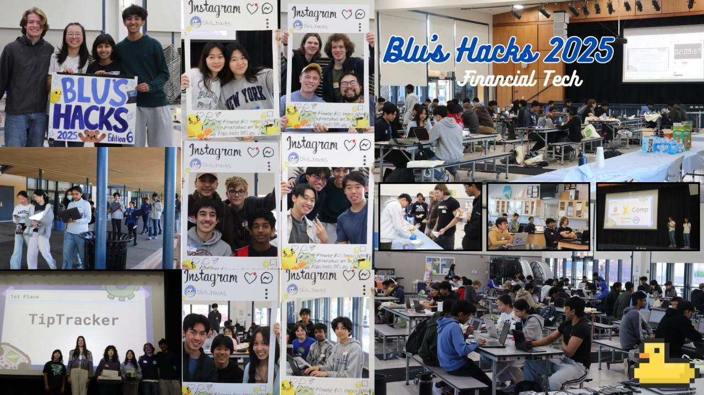
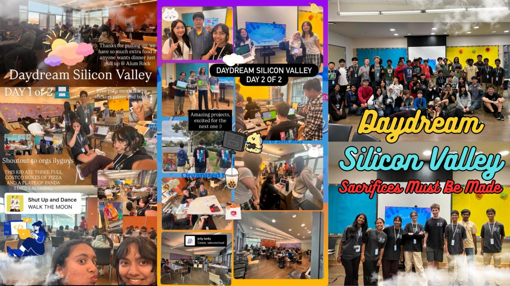
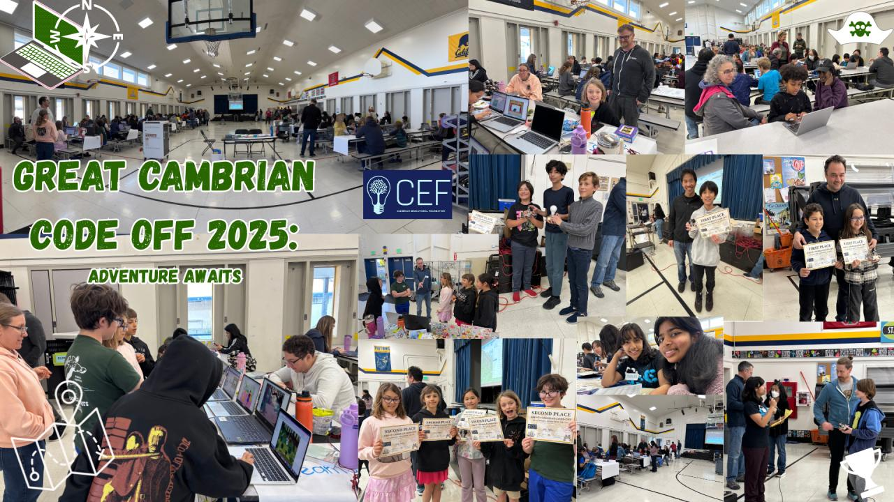

<h1 align="center">Hello, I'm Dristi! :D</h1>
<h3 align="center">💻 Computer Science Researcher · Developer · Maker</h3>
I'm a high-school student from San Jose exploring the intersections of machine learning and neuro.

(If you're reading this from University of California or NCWIT or Hack Club, hi!!!)

### 🧰 My Relevant Coursework  
BHS: Computer Science PLTW, Computer Science A

EVC: Computer Programming in C, CS 2 in C++

WVC: Computer Programming in Java, Advanced Python, Intro App/Graphic Design.

ATDP: Data Science 1 in R

UCSB: Intro to Research (Neuromorphic Computing)

  

### 🧰 My Languages  

  
  
  
  
  
  
  
  
  

### My Toolkit

  
  
  
  
  
  
  
  
  
  
  
  
  
  
  
  
  
  
  
  
  
  
  
  
  

### Events I've Run :>

  
  
  

#### Certifications
Programming I, Programming II, Scrum Methodologies, all AI GWC SPP Certs

### 📊 Coding Stats  
Please note that a LARGE majority of my hours and code don't get tracked in Github or Hackatime.
<!-- Replace with your Hackatime or Wakatime badge URL -->

  

*(Powered by [wakatime.com](https://wakatime.com))*  

---
